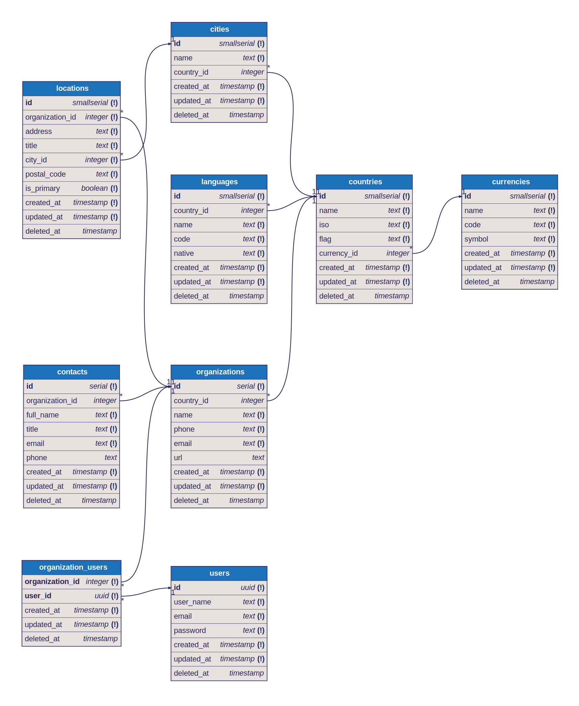

### Description

Rainbow Trading Application.

This Project is configured using Fastify Adaptor for performance. For more information, please read the guidelines [here](https://docs.nestjs.com/techniques/performance)

### Project setup

```bash
$ npm install
```

### Compile and run the project

```bash
# development
$ npm run start

# watch mode
$ npm run start:dev

# production mode
$ npm run start:prod
```

### Custom Exception

We have designed Custom Exception for Database. Instead of default ```NotFoundException``` from the Core NestJs, please use this  any Database Exception

```typescript
throw new DBNotFoundException('Organization', { id });
```

__This DBException Function Takes two Parameters__

| Parameter     | Type      | Description                            |
| ------------- | --------- | -------------------------------------- |
| `entity` | `string` | The Database Entity or the Module, Usually It will be Module|
| `id` or `ids` | `number` or `string` | Id of the Resource or Ids of the Resources |

### Run tests

```bash
# unit tests
$ npm run test

# e2e tests
$ npm run test:e2e

# test coverage
$ npm run test:cov
```

### Drizzle -Studio
```bash
$ npx drizzle-kit studio
```

### Drizzle - Generate
```bash
$ npx drizzle-kit generate
```

### Drizzle - Migrate
```bash
$ npx drizzle-kit migrate
```

##### Drizzle - Seed
```bash
$ npm run db:seed
```


### Database Schemas

__We are using Drizzle ORM with Postgresql.__

### Schemas

* All the Schemas should be in this location. You can create a new entity in ```/src/database/entity.schema.ts```
* Once you created the schema, the next step is to add that schema in ```/src/database/schema.ts```
* ``` export * from './entities.schema'; ```
#### Schema Naming Conventions
* The Table Name should be Lower Case Letters. For example ``` locations```
* If the Table Name has multiple words, then it should be seperated by '_'. For example ``` organization_users```
* If the Column has multiple words, Should use snake case for example ``` userName ```.

### How to Seed (Step By Step)

In order to Add Seed Files, You need to Understand the different files.

#### Seed Data

  * Create a entities.ts (replace the name)
  * For Reference you can check locations.ts
  * all the files should be stored in src/seeder/data/
  * you can associate an entity, for example you can check location entity, which is inside Locations Module.
#### Seeder
  * Create a entities.seeder.ts (replace the name)
  * For Reference you can check locations.seeder.ts
  * all the files should be stored in src/seeder/seed/
  * you can associate an entity, for example you should associate the locations schema.

#### Sequence Reset Policy
Because we are manually managing primary key values during seeding, the standard PostgreSQL sequence reset logic ```(SELECT setval(...))``` is only required for tables that use an __auto-incrementing integer (serial) column__.

For tables using __UUIDs (like users)__ or tables with __composite keys__ that lack a serial ```id``` column (like __organization_users__ and __organizations_locations__), resetting the sequence is unnecessary and will often lead to database errors.

To align with this, the BaseSeeder is designed to conditionally skip the sequence reset rather than relying on a fixed, protected field like shouldResetSequence = false; in every child seeder.

For example in __users.seeder.ts__

```typescript 
protected readonly shouldResetSequence = false;
```
##### Seeder Module
  * Add the created seeder in the provider section of Seeder module. seeder.module.ts which is here src/seeder/seeder.module.ts
##### Seeder Service
  * Need to add the Seeder in the seeder.service.ts which is here /seeder/seeder.service.ts
  * Define in the constructor ```private readonly locationsSeeder: LocationsSeeder```,
  * need to assign ```{ instance: this.locationsSeeder, order: 6 },``` 
  * ! Note: Change the order. This order determines the seed class to be executed in an order. Please be cautious
  * Once Done, you can run ```npm run db:seed```

### DBML

DBML (Database Markup Language) is an open-source DSL language designed to define and document database schemas and structures. It is designed to be simple, consistent and highly-readable.

#### DBML Installation
* npm : ```$ npm install -g @dbml/cli ```
* yarn : ```$ yarn global add @dbml/cli ```
* pnpm : ```$ pnpm add -g @dbml/cli ```

#### Convert a DBML file to SQL

```sql
$ dbml2sql schema.dbml

CREATE TABLE "staff" (
  "id" INT PRIMARY KEY,
  "name" VARCHAR,
  "age" INT,
  "email" VARCHAR
);
```
##### By default it will generate to "PostgreSQL". To specify which database to generate to:

```sql
$ dbml2sql schema.dbml --mysql

CREATE TABLE `staff` (
  `id` INT PRIMARY KEY,
  `name` VARCHAR(255),
  `age` INT,
  `email` VARCHAR(255)
);

```

##### To output to a file you may use --out-file or -o:
```bash
$ dbml2sql schema.dbml -o schema.sql
  ✔ Generated SQL dump file (PostgreSQL): schema.sql
```
##### Convert a SQL file to DBML

Note: Change the Location of the SQL and the output file. 

```bash
$ sql2dbml drizzle/0000_nasty_siren.sql -o schema.dbml

Table staff {
  id int [pk]
  name varchar
  age int
  email varchar
}
...
```

### Graphviz

Graph visualization is a way of representing structural information as diagrams of abstract graphs and networks. Automatic graph drawing has many important applications in software engineering, database and web design, networking, and in visual interfaces for many other domains.

### Graphviz Download
* Doownload Link : https://graphviz.org/download/
* Linux (Ubuntu) : ```$ sudo apt install graphviz ```
* Linux (Centos, Federoa) : ``` $ sudo dnf install graphviz ```
* Windows : Download from one of the sources here.
* Mac (Port) : ``` $ sudo port install graphviz ```
* Mac (brew) : ``` $ brew install graphviz ```

### Graphviz Visual Studio Code Extension
Download Link : https://marketplace.visualstudio.com/items?itemName=EFanZh.graphviz-preview

### DBML Renderer

dbml-renderer renders DBML files to SVG images. It provides a command line interface, so that you can easily use it in your documentation toolchain. Need to download Two Extensions one is Preview and the Second one to export to SVG

* Download Link : https://github.com/softwaretechnik-berlin/dbml-renderer?tab=readme-ov-file
* Visual Studio Extension : https://marketplace.visualstudio.com/items?itemName=nicolas-liger.dbml-viewer 
* Visual Studio Extension : https://marketplace.visualstudio.com/items?itemName=matt-meyers.vscode-dbml


### 🏢 Organizations API — Postman Collection

#### Base URL 
Endpoint: ```http://localhost:3000/organizations```

### GET — Find All Organizations
Endpoint: ``` /organizations ```

#### Example Request:
```
GET http://localhost:3000/organizations?limit=5&offset=0&order=asc&sortBy=id&contactName=wunsch&countryName=vietnam
```
#### Query Parameters (Optional):
| Parameter     | Type     | Description                                     |                |
| ------------- | -------- | ----------------------------------------------- | -------------- |
| `sortBy`      | `string` | Column to sort by (`name`, `email`, `id`, etc.) |                |
| `order`       | `'asc'   | 'desc'`                                         | Sort direction |
| `limit`       | `number` | Pagination limit                                |                |
| `offset`      | `number` | Pagination offset                               |                |
| `contactName` | `string` | Filter by contact name                          |                |
| `countryName` | `string` | Filter by country name                          |                |
| `deleted`     | `string` | Filter by Soft Delete                           |                |

### 🔎 GET — Find One Organization
GET ```/organizations/:id```

__By Default, it will get the records which are not Soft Deleted.__

#### Example Request:
```GET http://localhost:3000/organizations/5?delete=true```

#### Query Parameters (Optional):

| Parameter     | Type      | Description                            |
| ------------- | --------- | -------------------------------------- |
| `deleted`      | `boolean` | Include soft-deleted records if `true` |

### 🆕 POST — Create Organization
#### Endpoint:
```POST /organizations```
#### Example Body:
```json
{
  "countryId": 8,
  "name": "Test Entity",
  "phone": "+8401347676",
  "email": "user@user.com",
  "url": "https://user.com"
}
```

### ✏️ PATCH — Update Organization
#### Endpoint:
```PATCH /organizations/:id```
#### Example Request:
```PATCH http://localhost:3000/organizations/5```

#### Example Body:
```json
{
  "countryId": 4,
  "name": "Test Entities",
  "phone": "+8412345676",
  "email": "users@users.com",
  "url": "https://users.com"
}
```
### 🗑️ DELETE — Soft Delete Organization
#### Endpoint:
```DELETE /organizations/:id```
#### Example Request:
```DELETE http://localhost:3000/organizations/5```

### 🔄 PATCH — Restore Soft-Deleted Organization
#### Endpoint:
```PATCH /organizations/restore/:id```
#### Example Request:
```PATCH http://localhost:3000/organizations/restore/5```

### 💣 DELETE — Permanently Delete Organization
#### Endpoint:
```POST /organizations/create``
#### Example Body:
```json
[
  {
    "countryId": 8,
    "name": "Test Entity",
    "phone": "+841232567",
    "email": "user@user.com",
    "url": "https://user.com"
  },
  {
    "countryId": 7,
    "name": "Test Entity",
    "phone": "+841234567",
    "email": "user@user.com",
    "url": "https://user.com"
  }
]
```

### 📦 POST — Bulk Create Organizations
#### Endpoint:
```PATCH /organizations/restore/:id```
#### Example Request:
```PATCH http://localhost:3000/organizations/restore/5```

### 🧹 DELETE — Bulk Soft Delete Organizations
#### Endpoint:
```DELETE /organizations/remove```
#### Example Request:
```json
{
  "ids": [2, 5, 8]
}
```

### ♻️ PATCH — Bulk Restore Organizations
#### Endpoint:
```PATCH /organizations/restore```
#### Example Request:
```json
{
  "ids": [2, 5, 8]
}
```
### 💀 DELETE — Bulk Hard Delete Organizations
#### Endpoint:
```DELETE /organizations/delete```
#### Example Request:
```json
{
  "ids": [2, 5, 8]
}
```
### Database Entity Diagram


### Swagger Api Documentation

We are using Swagger, [api](https://localhost:3000/api).